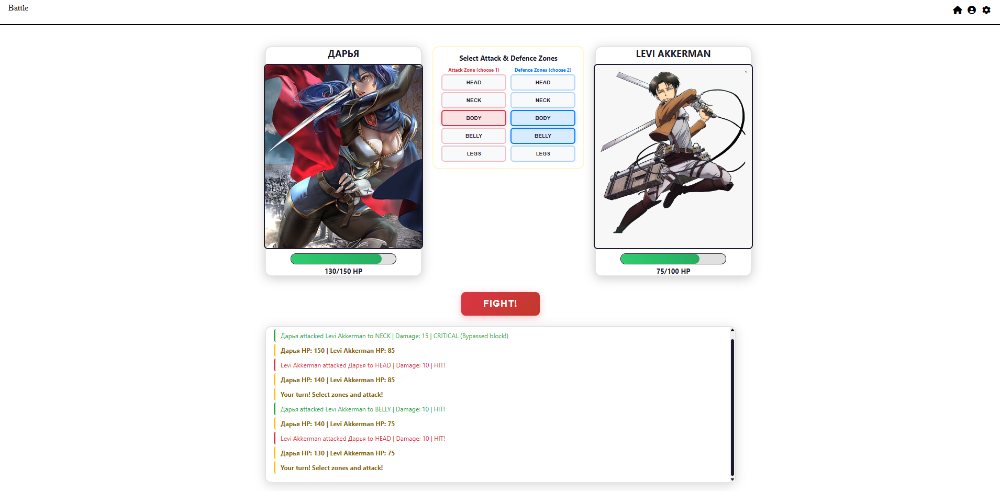
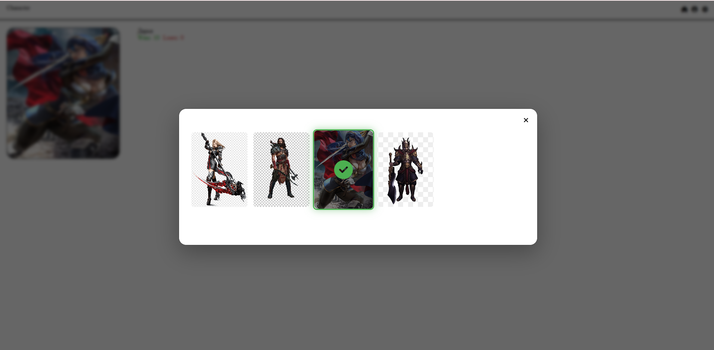
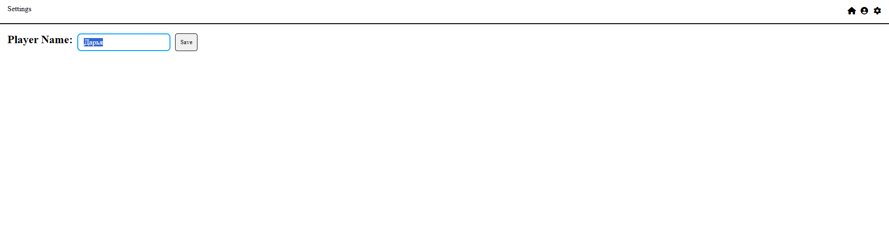
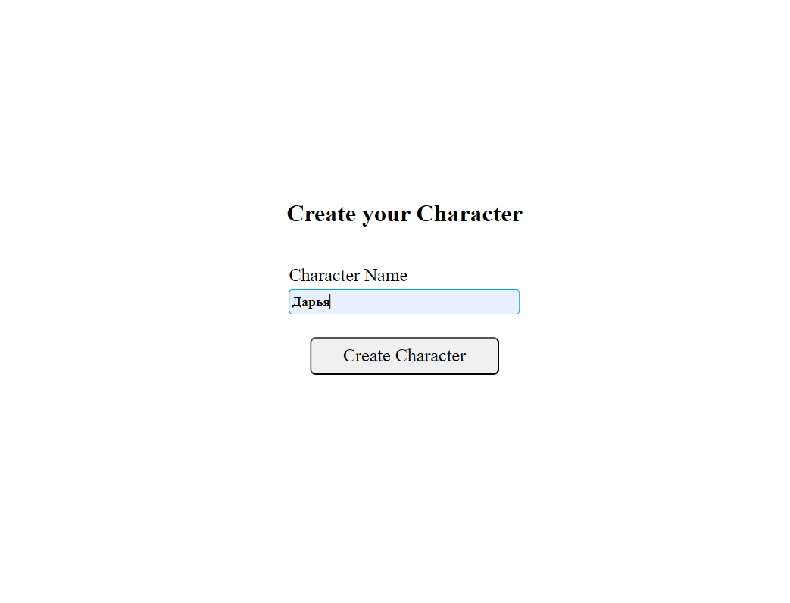

#  Not Fight Club

1. Task: https://github.com/rolling-scopes-school/tasks/blob/master/stage0.5%20Bootcamp/tasks/notFightClub/README.md
2.
## battle-page

## Character-page

## Settings-page

## Registration-page

3. Deploy: https://daryadudkova98.github.io/not-fight-club/

4. Submittion Date: 2026-07-27 02:59  / Deadline Date: 2026-07-15 22:52

5.
## Battle mechanics
- [x] The game has a set of attack zones and defense zones (e.g. head, body, legs).
- [x] Each turn the player picks one zone to attack and two zones to defend. Until the player picks the correct number of zones, the game must prevent them from attacking (e.g. the attack button stays disabled).
- [x] After the player confirms, both sides exchange blows simultaneously.
- [x] Each opponent has its own attack/defense profile.
- [x] The demo, for example, has 3 opponents - a spider that attacks two zones and blocks one, a troll that attacks one zone and blocks three, and so on. Your opponent pool must include at least 2 opponents with different profiles.
- [x] The opponent's choices each turn are random within its profile.
- [x] Random zones must not repeat within the same turn (e.g. the spider can't attack the legs twice in one turn).
- [x] Damage is dealt only where attack zones do not overlap defense zones. If the player attacked the head and the opponent blocked the head - no damage. The same applies the other way around.
- [x] After the exchange, each side's health is reduced by the unblocked damage they received.
- [x] Critical hits: both player and opponent have a chance to land a critical hit. A critical hit deals extra damage (the demo uses ×1.5). A critical hit also breaks through a block - if the target was defending the zone, the hit still lands and deals critical damage.
Balance rule: every fighter's HP must be at least 3× their base damage, so that no fight can end in one turn.

## Settings page
- [x] change the player's name.

## Character page
- [x] avatar, name, win/loss record, ability to change the avatar.

## Home page
- [x] start button that creates a new battle.

## Registration screen
- [x] single input for the player's name.
